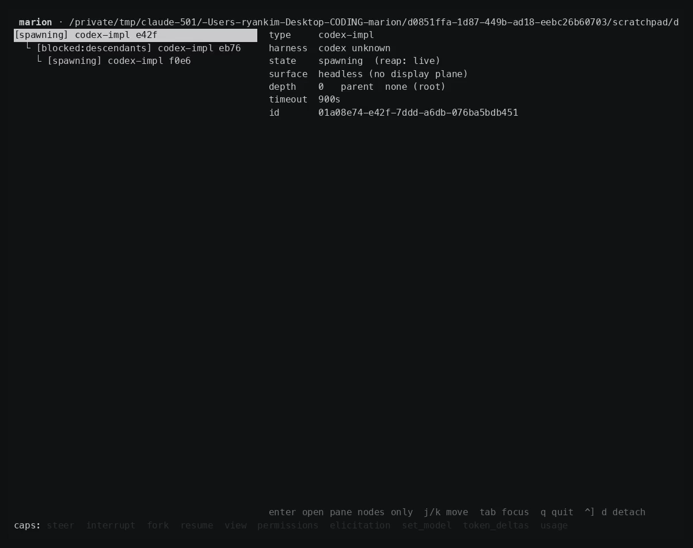
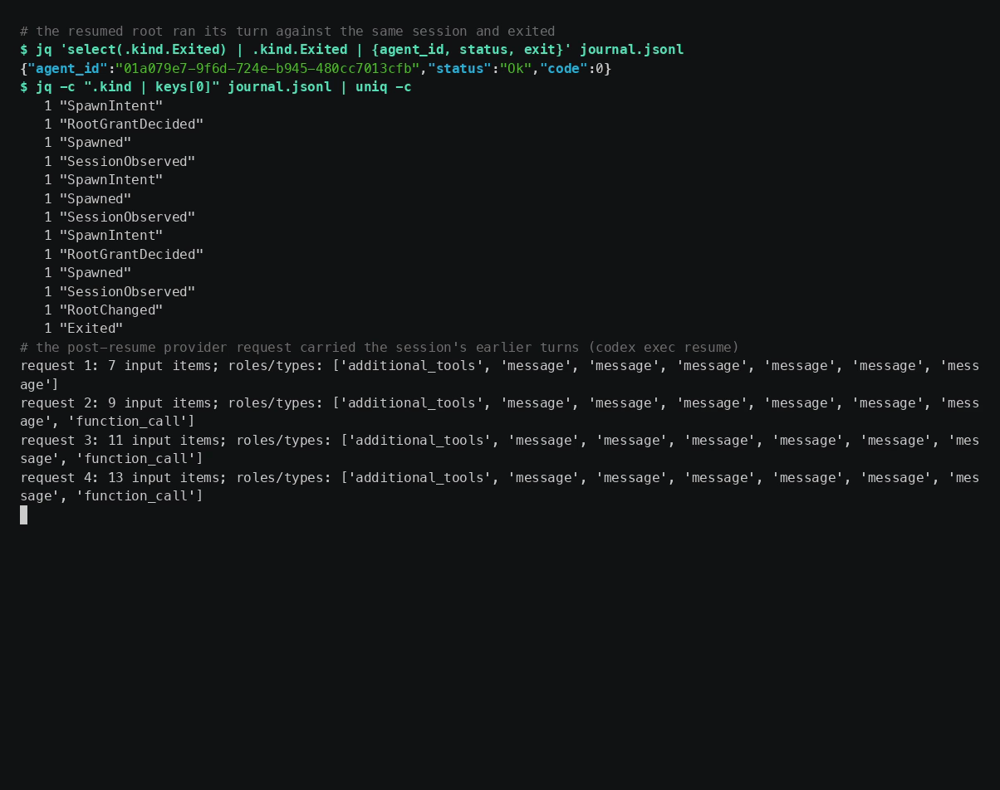
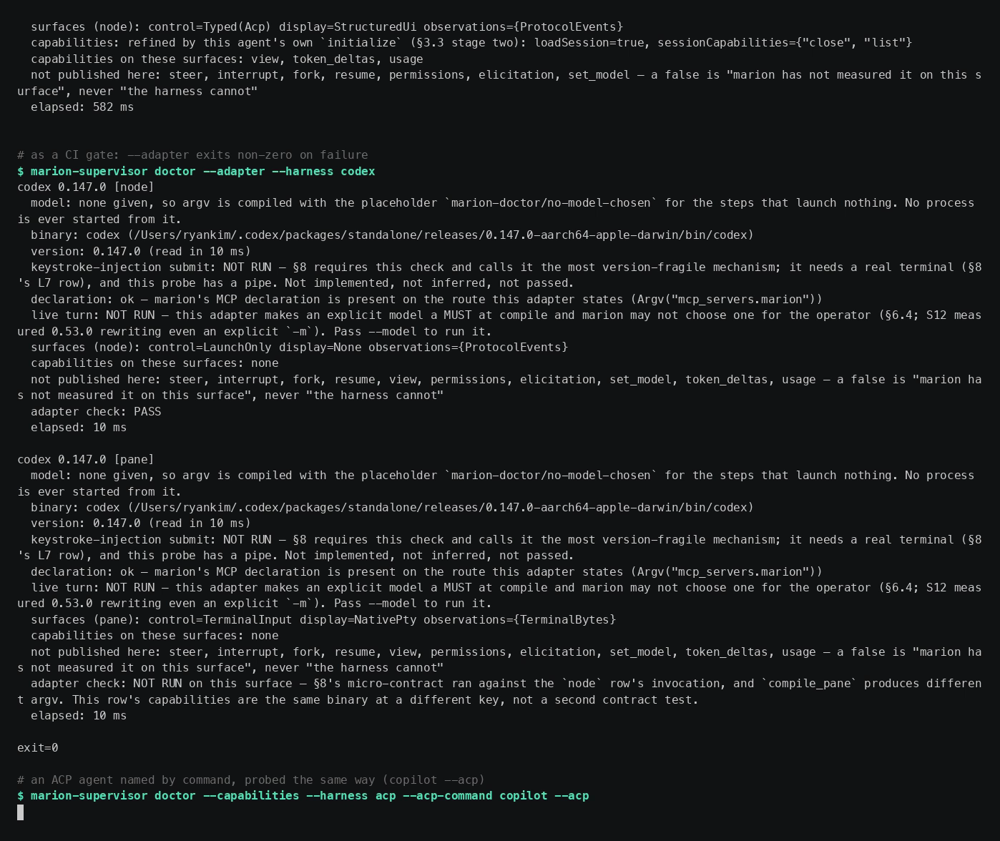

# marion

marion runs any agent harness — Claude Code, Codex, Gemini CLI, opencode, Copilot CLI, goose, Cline, Qwen Code, or any ACP agent — as a first-class subagent of any other, and gives you one supervisor and one UI over the whole tree.


Full 8-minute demo (21 scenes, 492 s): [marion-demo.mp4](https://github.com/RyanKim17920/marion/releases/download/v0.1.0/marion-demo.mp4) attached to the [v0.1.0 release](https://github.com/RyanKim17920/marion/releases/tag/v0.1.0).

## What marion does

- Supervises eight harnesses as one tree. Every node is journaled, addressable by id, and shown in the same view regardless of which CLI is behind it.
- Gives a running agent five tools over MCP — `spawn`, `wait`, `status`, `list`, `report` — so a harness delegates to another harness by calling a tool, not by shelling out.
- Runs a harness's own TUI as a marion root: `marion claude`, `marion codex`, `marion gemini`, `marion opencode`, `marion copilot`. Same login, same keybindings, plus marion's MCP server injected and the session journaled.
- Attaches to any live node's terminal (`marion attach`) and shows the fleet as a tree with a detail pane and a per-node capability strip (`marion tree`).
- Survives its own death. `kill -9` the supervisor and `marion resume <id>` relaunches the lost root under the same id against the same session, recorded as a second generation.
- Enforces the gates in the topology, not in a prompt: a node cannot exit while a descendant is live, delegation stops at `max_depth 3`, a run past `--timeout` has its process group killed, and a node may address only its own descendants and its parent.
- Reaches any ACP agent with no adapter code: `acp:<command> [args…]` launches it and speaks the protocol; `marion-supervisor doctor --acp-command "<cmd>"` probes one by its own handshake.
- Treats harness drift as a first-class problem. Versions are pinned by evidence, an unadmitted version fails by name rather than skipping, and at runtime `doctor --capabilities` measures the installed binary and the TUI dims what it has not measured.

The contract every layer is built around:

```
Agent(harness, model, tools, prompt, …) -> handle
handle: observe · steer · interrupt · result
```

Topology is a star, not a mesh: 1→N fan-out, N→1 fan-in, every edge has a parent.

## Quick start

Requires Rust 1.94 (pinned in `rust-toolchain.toml`), macOS or Linux, and at least one harness CLI on `PATH`.

```sh
cargo install --path crates/marion-supervisor   # installs both `marion` and `marion-supervisor`
```

Both binaries must land in the same directory — `marion` resolves the supervisor next to itself.

```sh
# A headless root against marion's canned provider: no credentials, no cost.
marion run codex --prompt "say hello" --canned

# The same, on the vendor you are already logged in to (this spends real money).
marion run codex --prompt "say hello"

# Codex's own TUI, as a journaled marion root with marion's MCP server connected.
marion codex

# The fleet, and one node's terminal.
marion tree
marion attach <agent-id>

# Relaunch a root whose supervisor died, under its own id.
marion resume <agent-id>

# What marion has actually measured about the harnesses on this machine.
marion-supervisor doctor --capabilities
marion-supervisor doctor --capabilities --harness codex
```

Bare `marion` asks three questions — harness, model, prompt — and then runs what `marion run` would. `marion mcp` serves marion's tools over stdio for an MCP client to be configured with; it is not a command to type at a terminal.

## Harnesses

| harness | pinned version | headless | native lane (`marion <harness>`) | ACP |
|---|---|---|---|---|
| `claude` (Claude Code) | 2.1.220 | yes, with a pane shape | yes | `claude-acp` |
| `codex` (Codex CLI) | 0.146.0 | yes, with a pane shape | yes | `codex-acp` |
| `gemini` (Gemini CLI) | 0.53.0 | yes | yes | `gemini` |
| `opencode` | 1.17.3 | yes | yes | `opencode` / `acp-opencode` |
| `copilot` (Copilot CLI) | 1.0.83 | yes | yes | `copilot` |
| `goose` | 1.49.0 | yes | no — interactive shape unmeasured | — |
| `cline` | 3.0.61 | yes | no — interactive shape unmeasured | — |
| `qwen` (Qwen Code) | 0.23.0 | yes | no — interactive shape unmeasured | — |
| `acp:<command>` | n/a | — | — | the generic path |

The pin is the oldest version whose evidence is on record, not a ceiling; the admitted set widens as versions are re-measured. Agent types layer intent on a harness — `codex-impl` and `claude-impl` grant `read` and `write`, plain `codex` and `claude` grant nothing. `marion run` with no arguments lists all fifteen.








## How it is tested

The test suite drives the real harness binaries, not mocks — only inference is canned. `cargo test --workspace` launches actual `claude`, `codex`, `opencode` and the rest against `marion-provider`, marion's own canned model server, which dispatches on request shape rather than arrival order and costs nothing; where a binary is absent the test skips loudly rather than silently. Every test runs through `scripts/cargo-runner.sh`, which puts an empty directory first on `PATH` so a harness is reached only through a shim that execs the admitted release, and `marion_testsupport::PINNED_HARNESSES` fails a version the table does not admit *by name* instead of skipping. When a harness has genuinely moved on, `scripts/admit-harness.sh <harness> <version>` widens the accepted set, picks the affected suites by grep rather than by hand, re-runs them, and restores the table byte-for-byte if anything goes red; it never commits. The shipped binary trusts none of this — `doctor --capabilities` re-measures at runtime. The last full verification (2026-09-11, commit `a2b3ed8`) ran all eight harnesses at their pins through the shim: 1378 lib tests and 40 integration suites, zero failures.

## Status

marion works end to end and is not finished. `MILESTONES.md` is the ledger — goals, principles, and every harness fact with the spike that measured it. `docs/specs/2026-07-31-marion-design.md` is the design, rev 3. Where the two disagree, MILESTONES wins on *what* and the design doc on *how*.

Open, honestly:

- **Linux start identity is measured; the rest of Linux is thin.** `/proc/<pid>/stat` field 22 is read and checked against `btime` and the `/proc/<pid>` mtime, including a `comm` containing a space and a `)`; every platform that is neither macOS nor Linux still refuses by name and resolves to cannot-tell. Windows is out of scope — the PTY host is POSIX only. No arm-vs-x86 difference has been measured on either OS, and the Linux native-relay lanes are still red (see MILESTONES).
- **Gemini is blocked vendor-side.** With gemini 0.53.0 on an individual account, `gemini -p` fails with `IneligibleTierError` and exit 55 before it reaches the model, with no marion involved. Gemini's green cells are all against the canned provider; do not read them as evidence that a live Gemini node works.
- **Live paid runs are barely on record.** One live ACP run against Copilot, on 2026-09-05. Everything else in the suite is canned, so the request shapes marion sends to paid endpoints are verified far less than the harness plumbing around them.
- Three native lanes stay disabled by name (`goose`, `cline`, `qwen`) because their interactive surfaces were never measured; `verification` lines are run but not journaled, so a resumed child runs with none; and a resumed child's declared scope carries in no record.

## Repository layout

| crate | what it is |
|---|---|
| `marion-core` | The IR: launch specs, registry model, journal, task contract, and the client↔supervisor wire vocabulary. No processes, no filesystem. |
| `marion-harness` | One `HarnessSpec` row per harness — argv, env, tool spelling, resume shape, update policy — each row naming the spike that measured it. |
| `marion-provider` | The canned model provider. Replays scripted responses across four wire formats, dispatching on request shape. |
| `marion-supervisor` | The supervisor itself, plus both binaries: the PTY host, registry, socket, spawn path, ACP driver, doctor, and native relay. |
| `marion-term` | A VT screen model for the display plane — a streaming grid with a ratatui adapter. |
| `marion-testsupport` | Shared test helpers, the pinned-version table, and the shim that runs an admitted release. |
| `marion-tui` | The attach pane and the `tree` view. |

## More

- [CONTRIBUTING.md](CONTRIBUTING.md) — how to build, test, and land a change.
- [MILESTONES.md](MILESTONES.md) — the ledger of what is verified and what is not.
- [docs/specs/](docs/specs/) — the design doc and the native-facade specs.
- [docs/research/](docs/research/) — research snapshots behind specific decisions.
