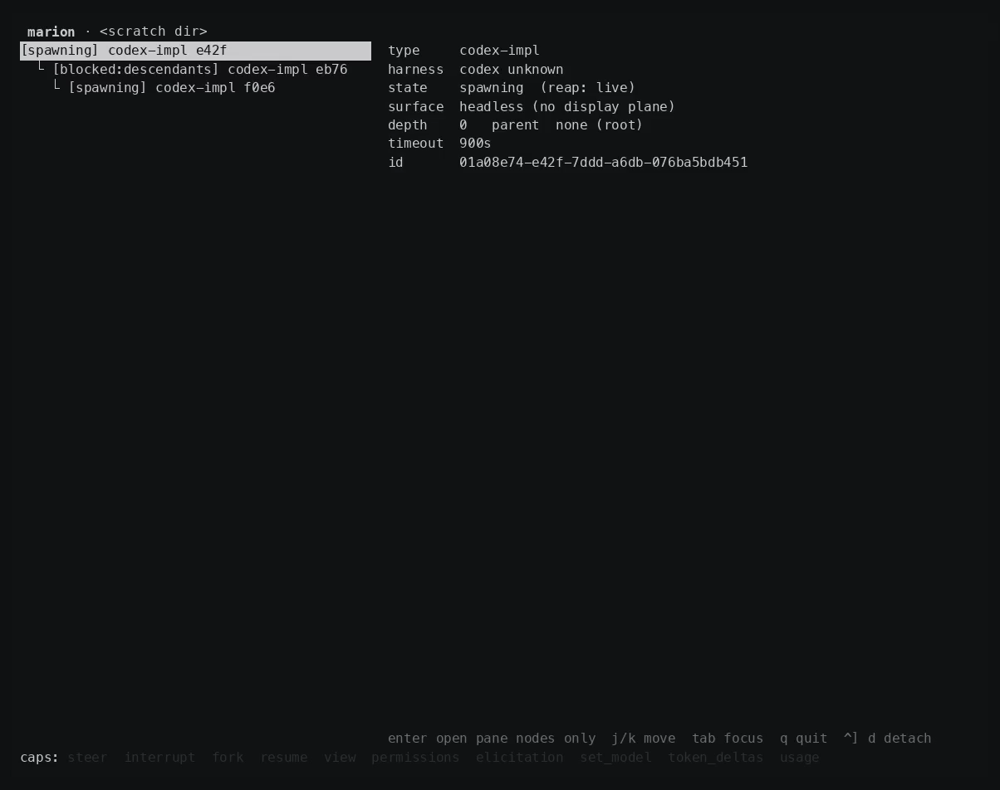
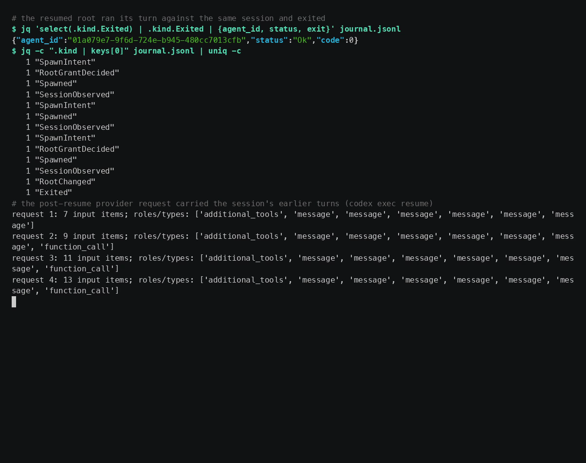
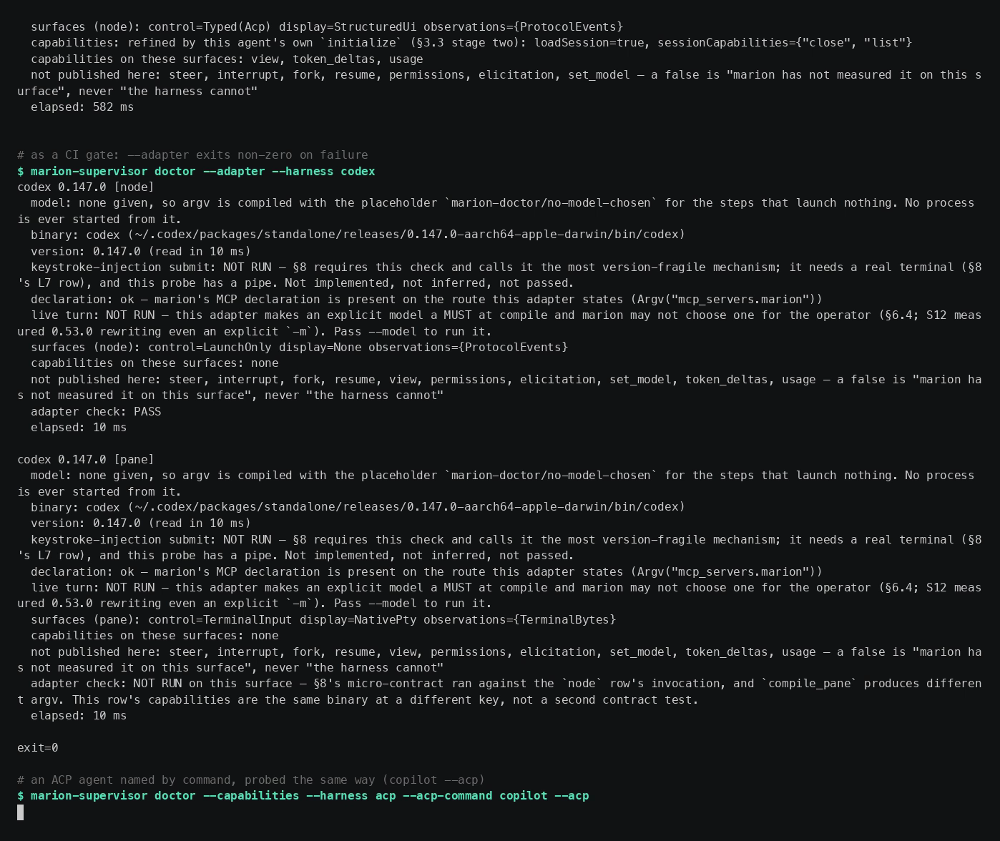

# marion

marion runs any agent harness — Claude Code, Codex, Gemini CLI, opencode, Copilot CLI, goose, Cline, Qwen Code, pi, or any ACP agent — as a first-class subagent of any other, and gives you one supervisor and one UI over the whole tree.

A demo of a Claude session delegating a build to a codex child is coming.

## What marion does

- Supervises eight harnesses as one tree. Every node is journaled, addressable by id, and shown in the same view regardless of which CLI is behind it.
- Gives a running agent six tools over MCP — `spawn`, `wait`, `status`, `list`, `steer`, `report` — so a harness delegates to another harness, and redirects what it delegated, by calling a tool, not by shelling out.
- Runs a harness's own TUI as a marion root: `marion claude`, `marion codex`, `marion gemini`, `marion opencode`, `marion copilot`. Same login, same keybindings, plus marion's MCP server injected and the session journaled.
- Attaches to any live node's terminal (`marion attach`) and shows the fleet as a tree with a detail pane and a per-node capability strip (`marion tree`).
- Survives its own death. `kill -9` the supervisor and `marion resume <id>` relaunches the lost root under the same id against the same session, recorded as a second generation.
- Enforces the gates in the topology, not in a prompt: a node cannot exit while a descendant is live, delegation stops at `max_depth 3`, a run past `--timeout` has its process group killed, and a node may address only its own descendants and its parent.
- Reaches any ACP agent with no adapter code: `acp:<command> [args…]` launches it and speaks the protocol; `marion-supervisor doctor --acp-command "<cmd>"` probes one by its own handshake.
- Treats harness drift as a first-class problem. Versions are pinned by evidence, an unadmitted version fails by name rather than skipping, and at runtime `doctor --capabilities` measures the installed binary and the TUI dims what it has not measured.

The contract every layer is built around:

```
Agent(harness, model, tools, prompt, …) -> handle
handle: observe · steer · interrupt · result
```

Topology is a star, not a mesh: 1→N fan-out, N→1 fan-in, every edge has a parent.

## Install

You need macOS or Linux, a Rust toolchain (1.94 or newer; the repository pins it in `rust-toolchain.toml`), and:

- at least one harness CLI on `PATH`, **already logged in**: marion runs each harness on the login you set up for it and never starts a login of its own;
- `git`, so each child can work in its own worktree and branch.

```sh
cargo install --locked --git https://github.com/RyanKim17920/marion marion-supervisor
marion --version
marion doctor
```

This installs two binaries, `marion` and `marion-supervisor`, into `~/.cargo/bin`. Keep them in the same directory: `marion` starts the supervisor that sits beside it, and `marion doctor` fails if the two come from different builds. marion never updates itself. To upgrade, run the install command again. From a checkout, `cargo install --locked --path crates/marion-supervisor` does the same.

Once a release is published, prebuilt binaries skip the Rust toolchain. Every channel installs the same archive, `marion` and `marion-supervisor` side by side:

- **Homebrew (macOS, Linux):** `brew install RyanKim17920/tap/marion`
- **Shell installer (macOS, Linux):** `curl --proto '=https' --tlsv1.2 -LsSf https://github.com/RyanKim17920/marion/releases/latest/download/marion-supervisor-installer.sh | sh`
- **npm (macOS, Linux, WSL; Node 14.14 or newer):** `npm install -g @ryankim17920/marion`
- **cargo binstall (a prebuilt archive, no compile):** `cargo binstall --git https://github.com/RyanKim17920/marion marion-supervisor`; or build it with the `cargo install` line above.
- **Windows:** install inside WSL 2 with any of the Linux channels above. Native Windows is not supported; `CONTRIBUTING.md` says why.

Archives cover macOS and Linux (glibc and static musl) on arm64 and x86_64. Upgrade with the channel you installed from: `brew upgrade`, `npm update -g`, or the same command again.

`marion doctor` checks both binaries, the OS, the state directory and its socket path, git, and every harness it finds, and ends with `overall: ready: yes` or `no`. A harness newer than the last version marion verified is marked unmeasured. It still runs.

## Quick start

```sh
# Free, no credentials: marion's canned provider plays a Claude Code root that delegates
# one edit to a Codex child. Needs `claude` and `codex` on PATH.
cargo install --locked --git https://github.com/RyanKim17920/marion marion-provider   # marion-canned
marion-canned &
marion run claude --prompt "say hello" --canned

# On your own login. These make real model calls and cost real money.
marion run codex --prompt "say hello"
marion run claude --model haiku --prompt "Spawn a codex child to create hello.txt containing hi, then tell me its branch."

# A harness's own TUI, as a journaled marion root with marion's MCP server connected.
marion claude
marion codex

# The fleet, one node's terminal, and a root relaunched after its supervisor died.
marion list
marion tree
marion attach <agent-id>
marion resume <agent-id>

# Queue a message for a running node's next turn, as the operator (id or the tree's short id).
marion steer 8ea3 "use the v2 API, not v1"

# Store a provider key for endpoint mode (read with echo off; or pipe it with --stdin).
marion login openrouter
marion login --list

# Any harness on that provider: a registry id before the model picks the endpoint (endpoint mode).
marion run opencode --prompt "say hello" --model openrouter:qwen/qwen3-coder
```

- **The first `marion claude` in a folder** shows Claude Code's own dialogs: whether you trust the folder, then a one-time "Loading development channels" warning, because marion loads its channel so that a background child's result reaches the session without a `wait`. `marion codex` asks its own trust question. They are the harness's prompts, so you answer them; marion never answers them for you.
- **Inside `marion <harness>`**, `^] d` detaches and leaves the session running (`marion attach <agent-id>` brings it back) and `^] s` toggles marion's status row. Every other key goes to the harness.
- **A child's work** lands on its own branch, `marion/<task_id>`, and marion never merges it into yours. See [Where a child's work lands](#where-a-childs-work-lands).
- **State** (journals, transcripts, sockets) lives under `$MARION_STATE_DIR`, else `$XDG_STATE_HOME/marion`, else `~/.local/state/marion`. Every command follows that rule, so `marion tree` shows a session only when it sees the same value the session started with.

**Steering.** A message for a running node goes into that node's inbox and reaches its model at the node's next turn boundary, never mid-sentence. A parent sends one with its `steer` tool, addressed by the `task_id` its `spawn` handle carries or by an `agent_id` from `list` (the only way to name a grandchild); the supervisor lets a node steer only nodes below it and refuses its parent, siblings and itself with one sentence. The operator presses `s` on a node in `marion tree` and types the message on the hint row (Enter sends, Esc cancels, the answer shows in the detail pane), or sends one with `marion steer <id|short-id> <text…>` (`-` reads stdin; exit 0 prints the queued message's id, exit 1 prints the supervisor's refusal — an ended node points at `marion resume`). Before steering, a parent's `status` on a running child shows its last few tool calls and the last line it wrote, read from the child's own event stream through its harness's row (an ACP child's through the protocol's own `session/update` frames). Which harnesses and shapes actually hand a queued message over is per row and still landing; `MILESTONES.md` says which.

`marion login <provider>` keeps a key you paste in the macOS Keychain (or, elsewhere or with `MARION_CREDENTIAL_STORE=file`, a `0600` file under `$XDG_CONFIG_HOME/marion/`); it never prints it and never runs a vendor's own login. `marion login custom <id> --base-url <url> --wire <wire>` adds your own OpenAI-, Anthropic- or Gemini-compatible endpoint to the user-level `providers.toml` (a repository's `.marion/` is never read for providers), and `marion logout <provider>` removes a key. Several keys for one provider are kept apart by label (`marion login openrouter --label work`, or `openrouter:work`); `providers.toml`'s `[credentials]` table states the order a launch tries them in. Subscription logins (Claude, ChatGPT, Copilot, Google accounts) stay with their own harness; marion never reuses them.

Bare `marion` asks three questions — harness, model, prompt — and then runs what `marion run` would. `marion mcp` serves marion's tools over stdio for an MCP client to be configured with; it is not a command to type at a terminal.

## Where a child's work lands

A child spawned with `isolation: "worktree"` works in its own git worktree on the branch `marion/<task_id>`. When it finishes, marion commits everything it changed onto that branch — authored as your configured git user, or `marion <marion@localhost>` if none is set, with hooks and signing skipped — removes the worktree directory, and keeps the branch. The contract records the branch and commit (`completion.branch`, `completion.commit`), and `marion run` prints them under the child's `CHILD` line as `changes on branch marion/<task_id> (<sha>); merge with: git merge marion/<task_id>`. marion never merges into your branch; review and merge it yourself:

```sh
git log -p HEAD..marion/<task_id>     # what the child did
git merge marion/<task_id>            # take it
git branch -D marion/<task_id>        # or drop it
```

Paths outside the child's `writable_scope` are committed too and listed in the contract's `scope_violations`, so decide before merging. A child that changed nothing leaves its branch at the commit it started from. If the commit itself fails, the worktree is kept rather than removed and the contract's exit description says where. A `shared-cwd` child writes straight into your directory, so there is nothing to merge.

## Harnesses

| harness | pinned version | headless | native lane (`marion <harness>`) | ACP |
|---|---|---|---|---|
| `claude` (Claude Code) | 2.1.220 | yes, with a pane shape | yes | `claude-acp` |
| `codex` (Codex CLI) | 0.146.0 | yes, with a pane shape | yes | `codex-acp` |
| `gemini` (Gemini CLI) | 0.53.0 | yes | yes | `gemini` |
| `opencode` | 1.17.3 (measured through 1.18.32) | yes | yes | `opencode` / `acp-opencode` |
| `copilot` (Copilot CLI) | 1.0.83 | yes | yes | `copilot` |
| `goose` | 1.49.0 | yes | no — interactive shape unmeasured | — |
| `cline` | 3.0.61 | yes | no — interactive shape unmeasured | — |
| `qwen` (Qwen Code) | 0.23.0 | yes | no — interactive shape unmeasured | — |
| `pi` | 0.80.2 | yes — MCP through marion's own `-e` extension | yes | — |
| `acp:<command>` | n/a | — | — | the generic path |

The pin is the oldest version whose evidence is on record, not a ceiling; the admitted set widens as versions are re-measured. Agent types layer intent on a harness. A plain harness name — `claude`, `codex`, `opencode`, … — is that harness's implementer and grants `read` and `write` (`<harness>-impl` is kept as an alias); `<harness>-orchestrator` is the read-only planner, on the harnesses where marion can withhold writes. `marion --help` lists all fourteen built-in types, and bare `marion` offers them in its picker.

**opencode, in all three of its shapes, against the two harnesses marion is most used with** —
each `yes` is a test that drives the real binary against the canned provider, or for `status` and usage a reader held to a real capture (`MILESTONES.md`, s36):

| | `claude` | `codex` | `opencode` (`run`) | `acp-opencode` | `marion opencode` |
|---|---|---|---|---|---|
| child: spawn, report, worktree, verification, landed branch | yes (verification and branch untested) | yes | yes | yes (verification on a fake agent) | — (a root) |
| parent: `spawn` reaches marion, contract comes back | yes | yes | yes | yes | yes |
| a steer reaches it | mid-turn fold | next generation | next generation (`--session`) | mid-turn fold | pasted |
| a background child's end reaches it | next turn | next generation | next generation | next prompt | pasted |
| resumed after the supervisor is killed | unit-tested only | yes | yes | yes (`session/load`) | — |
| `status` shows its recent calls; usage read | yes | yes | yes (reasoning counted) | yes | — (no stream) |
| an expired child leaves no tool process | — | yes | yes | yes | — |
| marion's tools approved at launch | `--allowedTools` | declaration key | declaration key | answers the ask | declaration key |

One gap is opencode's own: `opencode run` names its session only once its first response streams,
so a node whose supervisor dies during its first request has nothing to resume.

### ACP agents

Any ACP agent runs through `acp:<command>`. These have a refinement row in `acp::AGENTS`, probed on 2026-09-27 (S33, `tests/fixtures/s33-acp-agents/`) without an account marion made or a login marion ran. "Opened" means `session/new` answered with a session; agents marked *provider* opened only once pointed at a provider through their own env, which on your machine is your own configuration for that agent. **Refused** rows were probed only to the account wall: `initialize` works, a session does not, and there is no built-in type for them.

| row | command | built-in type | session/new | notes |
|---|---|---|---|---|
| `opencode` | `opencode acp` | `acp-opencode` | opened | tool call measured; canned recipe |
| `claude-acp` | `npx -y @agentclientprotocol/claude-agent-acp@0.66.0` | `acp-claude-acp` | opened (your claude login) | tool call measured; live file write 2026-09-27 |
| `codex-acp` | `codex-acp` | `acp-codex-acp` | opened (your codex login) | tool call measured; live file write 2026-09-27 |
| `copilot` | `copilot --acp` | `acp-copilot` | opened (your login) | bridge only through `--additional-mcp-config` |
| `kilo` | `kilo acp` | `acp-kilo` | opened, no account | a prompt needs a Kilo login or provider |
| `qwen` | `qwen --acp` | `acp-qwen` | opened, *provider* | turn run against a local endpoint; MCP tools deferred behind `tool_search` |
| `goose` | `goose acp` | `acp-goose` | opened, *provider* | turn run against a local endpoint |
| `fast-agent` | `fast-agent-acp -x` | `acp-fast-agent` | opened, *provider* | real bridge call against a local endpoint |
| `vibe` | `vibe-acp` | `acp-vibe` | opened, *provider* | no turn run |
| `vtcode` | `vtcode acp` | `acp-vtcode` | opened | needs `VT_ACP_ENABLED=1` or `[acp]` in its config; no turn run |
| `gemini` | `gemini --acp` | — | **refused** | Gemini Code Assist ineligibility |
| `auggie` | `auggie --acp` | — | **refused** | `auggie login` (account) |
| `qoder` | `qodercli --acp` | — | **refused** | `qodercli login` (account) |
| `cline` | `cline --acp` | — | **refused** | wants an ACP `authenticate` first |
| `pi-acp` | `pi-acp` | — | **refused** | shim/pi version skew |

`marion doctor --capabilities --harness acp` probes every row and names the MCP transports each agent advertises; `--acp-command "<cmd>"` adds your own, and says when it turns out to be one of these rows.








## How it is tested

The test suite drives the real harness binaries, not mocks — only inference is canned. `cargo test --workspace` launches actual `claude`, `codex`, `opencode` and the rest against `marion-provider`, marion's own canned model server, which dispatches on request shape rather than arrival order and costs nothing; where a binary is absent the test skips loudly rather than silently. Every test runs through `scripts/cargo-runner.sh`, which puts an empty directory first on `PATH` so a harness is reached only through a shim that execs the admitted release, and `marion_testsupport::PINNED_HARNESSES` fails a version the table does not admit *by name* instead of skipping. When a harness has genuinely moved on, `scripts/admit-harness.sh <harness> <version>` widens the accepted set, picks the affected suites by grep rather than by hand, re-runs them, and restores the table byte-for-byte if anything goes red; it never commits. The shipped binary trusts none of this — `doctor --capabilities` re-measures at runtime. CI (`.github/workflows/ci.yml`) runs fmt, clippy, the unit tests and every integration suite whose harness-launching tests can skip, on each push; the live matrix needs the real binaries and a real terminal, so it is run by hand. The most recent full run recorded in `MILESTONES.md` is 2026-09-11 at `a2b3ed8` (eight harnesses at their pins, zero failures); later commits are covered by CI and by the live suites re-run for each change, not by a new full run.

## Status

marion works end to end and is not finished. `MILESTONES.md` is the ledger — goals, principles, and every harness fact with the spike that measured it. `docs/specs/2026-07-31-marion-design.md` is the design, rev 3. Where the two disagree, MILESTONES wins on *what* and the design doc on *how*.

Open, honestly:

- **Linux start identity is measured; the rest of Linux is thin.** `/proc/<pid>/stat` field 22 is read and checked against `btime` and the `/proc/<pid>` mtime, including a `comm` containing a space and a `)`; every platform that is neither macOS nor Linux still refuses by name and resolves to cannot-tell. Windows is out of scope — the PTY host is POSIX only. No arm-vs-x86 difference has been measured on either OS, and the Linux native-relay lanes are still red (see MILESTONES).
- **Gemini is blocked vendor-side.** With gemini 0.53.0 on an individual account, `gemini -p` fails with `IneligibleTierError` and exit 55 before it reaches the model, with no marion involved. Gemini's green cells are all against the canned provider; do not read them as evidence that a live Gemini node works.
- **Live paid runs are barely on record.** One live ACP run against Copilot, on 2026-09-05. Everything else in the suite is canned, so the request shapes marion sends to paid endpoints are verified far less than the harness plumbing around them.
- Three native lanes stay disabled by name (`goose`, `cline`, `qwen`) because their interactive surfaces were never measured, and a resumed child's declared scope and acceptance criteria carry in no record (its `verification` lines are journaled on its spawn intent and re-run on resume).

## Repository layout

| crate | what it is |
|---|---|
| `marion-core` | The IR: launch specs, registry model, journal, task contract, and the client↔supervisor wire vocabulary. No processes, no filesystem. |
| `marion-harness` | One `HarnessSpec` row per harness — argv, env, tool spelling, resume shape, update policy — each row naming the spike that measured it. |
| `marion-provider` | The canned model provider. Replays scripted responses across four wire formats, dispatching on request shape. |
| `marion-supervisor` | The supervisor itself, plus both binaries: the PTY host, registry, socket, spawn path, ACP driver, doctor, and native relay. |
| `marion-term` | A VT screen model for the display plane — a streaming grid with a ratatui adapter. |
| `marion-testsupport` | Shared test helpers, the pinned-version table, and the shim that runs an admitted release. |
| `marion-tui` | The attach pane and the `tree` view. |

## More

- [CONTRIBUTING.md](CONTRIBUTING.md) — how to build, test, and land a change.
- [MILESTONES.md](MILESTONES.md) — the ledger of what is verified and what is not.
- [docs/specs/](docs/specs/) — the design doc and the native-facade specs.
- [docs/research/](docs/research/) — research snapshots behind specific decisions.
